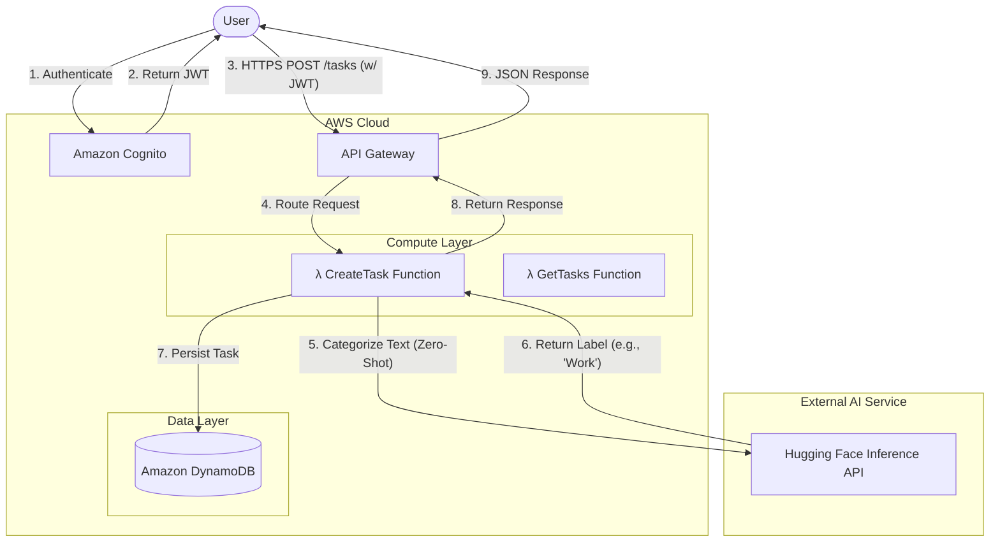

# Serverless AI Task Manager


## 📋 Executive Summary

The **Serverless AI Task Manager** is a scalable, event-driven application designed to demonstrate the power of modern serverless architecture combined with artificial intelligence. This project automates the categorization of user tasks using a **Zero-Shot Classification** model hosted on Hugging Face, eliminating the need for manual organization.

Built entirely on **AWS Serverless** primitives, it leverages **Infrastructure as Code (IaC)** for reproducible deployments and adheres to security best practices with **AWS Cognito** and **IAM** least privilege principles. This solution represents a production-ready template for building intelligent, cost-effective, and highly available microservices.

## 🏗️ Architecture

The application adopts a fully serverless, event-driven architecture. User requests are securely authenticated and routed through API Gateway to Lambda functions, which orchestrate the logic between the database and external AI services.



### Request Flow
1.  **Authentication**: Users authenticate via **Amazon Cognito** to receive a secure JWT token.
2.  **API Entry**: Authenticated requests are sent to **AWS API Gateway**, which handles throttling, validation, and request routing.
3.  **Business Logic**:
    *   **Create Task**: The Lambda function receives the task description. It calls the **Hugging Face Inference API** using a `facebook/bart-large-mnli` model to classify the text into categories like *Work, Personal, Finance, or Health*.
    *   **Get Tasks**: Retrieves authenticated user's tasks from the database.
4.  **Persistence**: Enriched task data is stored in **Amazon DynamoDB**, a serverless NoSQL database chosen for its single-digit millisecond latency at any scale.

## 🌟 Key Features

*   **🤖 AI-Powered Intelligence**: Integrates state-of-the-art **Zero-Shot Text Classification** (BART Large MNLI) to automatically categorize tasks without training custom models.
*   **⚡ Serverless & Scalable**: Zero infrastructure management. **AWS Lambda** scales automatically from 0 to thousands of concurrent requests, while **DynamoDB** handles data throughput seamlessly.
*   **🔐 Enterprise-Grade Security**: 
    *   User management and authentication via **AWS Cognito**.
    *   Fine-grained permissions with **AWS IAM** roles (Least Privilege).
    *   API protection using **API Kyes** and Usage Plans.
*   **🏗️ Infrastructure as Code (IaC)**: Complete environment provisioning (Compute, Database, Networking, Security) managed via **Terraform state**, ensuring drift-free deployments.
*   **🌐 Robust API Management**: Uses **AWS API Gateway** for structured REST endpoints, request throttling, and deployment staging.

## 🛠️ Technology Stack

| Category | Technology | Purpose |
|----------|------------|---------|
| **Compute** | AWS Lambda (Node.js 18.x) | Serverless execution of business logic. |
| **API** | AWS API Gateway | Managed REST API entry point with rate limiting. |
| **Database** | Amazon DynamoDB | Fast, flexible NoSQL database for task storage. |
| **Auth** | AWS Cognito | Secure user directory and authentication. |
| **AI/ML** | Hugging Face Inference API | Zero-shot text classification model endpoint. |
| **IaC** | Terraform (HCL) | Declarative infrastructure provisioning and state management. |
| **Languages** | JavaScript / Node.js | Core application logic. |
| **Tools** | AWS CLI, Git | Deployment and version control. |

## 🚀 Getting Started

### Prerequisites
*   **AWS CLI** configured (`aws configure`)
*   **Terraform** (v1.0+) installed
*   **Node.js** (v18+) and **npm** installed
*   **Hugging Face API Key** (for AI inference)

### Deployment

1.  **Clone the Repository**
    ```bash
    git clone https://github.com/your-username/Serverless-AI-task-manager.git
    cd Serverless-AI-task-manager
    ```

2.  **Install Dependencies**
    Prepare the Lambda functions:
    ```bash
    cd lambdas/createTask && npm install
    cd ../getTasks && npm install
    cd ../../
    ```

3.  **Deploy Infrastructure**
    Initialize and apply Terraform configuration:
    ```bash
    cd infra
    terraform init
    terraform apply -var="hf_api_key=HUGGING_FACE_KEY"
    ```
    *Confirm the deployment by typing `yes`.*

4.  **Verify & Test**
    After deployment, Terraform will output the `api_invoke_url`.
    ```bash
    # Create a task
    curl -X POST https://<api-id>.execute-api.us-east-1.amazonaws.com/prod/tasks \
      -H "Content-Type: application/json" \
      -H "x-api-key: <your-api-key>" \
      -d '{"description": "Buy groceries for the week"}'
    
    # Response should include auto-detected category: "Shopping"
    ```

## 🧹 Clean Up

To avoid incurring charges, destroy the infrastructure when finished:
```bash
terraform destroy
```

